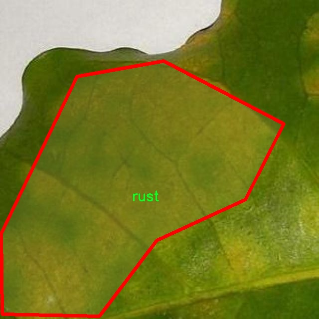

# 植物病害图像分割系统源码＆数据集分享
 [yolov8-seg-EfficientHead＆yolov8-seg-EfficientRepBiPAN等50+全套改进创新点发刊_一键训练教程_Web前端展示]

### 1.研究背景与意义

项目参考[ILSVRC ImageNet Large Scale Visual Recognition Challenge](https://gitee.com/YOLOv8_YOLOv11_Segmentation_Studio/projects)

项目来源[AAAI Global Al lnnovation Contest](https://kdocs.cn/l/cszuIiCKVNis)

研究背景与意义

随着全球人口的不断增长，农业生产面临着前所未有的挑战。植物病害的发生不仅影响作物的产量和质量，还可能导致严重的经济损失。因此，及时、准确地识别和诊断植物病害显得尤为重要。传统的植物病害识别方法多依赖于人工观察和经验判断，效率低下且容易受到主观因素的影响。近年来，随着计算机视觉和深度学习技术的迅猛发展，基于图像处理的植物病害识别方法逐渐成为研究热点。

YOLO（You Only Look Once）系列模型以其高效的实时目标检测能力而受到广泛关注。YOLOv8作为该系列的最新版本，结合了更先进的网络结构和算法优化，能够在保证检测精度的同时显著提高处理速度。尤其是在实例分割任务中，YOLOv8展现出了卓越的性能，能够有效地分离重叠的目标并进行精确的边界识别。因此，基于改进YOLOv8的植物病害图像分割系统的研究具有重要的理论和实践意义。

本研究将利用一个包含1800幅图像的植物病害数据集，该数据集涵盖了五个类别，包括Cescospora、Healthy、Phoma、miner和rust。这些类别不仅代表了不同类型的植物病害，还包括健康植物的图像，形成了一个多样化的样本库。通过对这些图像进行深入分析和处理，可以为植物病害的自动识别提供坚实的数据基础。数据集的多样性和丰富性使得模型在训练过程中能够学习到不同病害的特征，从而提高模型的泛化能力和识别准确率。

在实际应用中，基于改进YOLOv8的植物病害图像分割系统可以帮助农民和农业工作者快速识别和诊断植物病害，进而采取相应的防治措施。这不仅能够减少农药的使用，提高农业生产的可持续性，还能有效降低经济损失，保障粮食安全。此外，该系统的推广应用还有助于推动农业智能化的发展，提升农业生产的科技含量。

综上所述，基于改进YOLOv8的植物病害图像分割系统的研究，不仅具有重要的学术价值，也具备广泛的应用前景。通过深入探索深度学习在植物病害识别中的应用，我们可以为农业生产提供更为高效、智能的解决方案，推动农业科技的进步与发展。未来的研究将致力于进一步优化模型性能，扩展数据集规模，并探索与其他技术的结合，以实现更为全面和精准的植物病害监测与管理。

### 2.图片演示


##### 注意：由于此博客编辑较早，上面“2.图片演示”和“3.视频演示”展示的系统图片或者视频可能为老版本，新版本在老版本的基础上升级如下：（实际效果以升级的新版本为准）

  （1）适配了YOLOV8的“目标检测”模型和“实例分割”模型，通过加载相应的权重（.pt）文件即可自适应加载模型。

  （2）支持“图片识别”、“视频识别”、“摄像头实时识别”三种识别模式。

  （3）支持“图片识别”、“视频识别”、“摄像头实时识别”三种识别结果保存导出，解决手动导出（容易卡顿出现爆内存）存在的问题，识别完自动保存结果并导出到tempDir中。

  （4）支持Web前端系统中的标题、背景图等自定义修改，后面提供修改教程。

  另外本项目提供训练的数据集和训练教程,暂不提供权重文件（best.pt）,需要您按照教程进行训练后实现图片演示和Web前端界面演示的效果。

### 3.视频演示

[3.1 视频演示](https://www.bilibili.com/video/BV1Ep1jYwESo/)

### 4.数据集信息展示

##### 4.1 本项目数据集详细数据（类别数＆类别名）

nc: 5
names: ['Cescospora', 'Healthy', 'Phoma', 'miner', 'rust']


##### 4.2 本项目数据集信息介绍

数据集信息展示

在本研究中，我们采用了名为“Yolov8”的数据集，以训练和改进YOLOv8-seg模型，旨在实现植物病害图像的高效分割。该数据集专门设计用于处理植物病害的检测与分类，包含了多种植物病害的图像，具有较高的实用价值和研究意义。数据集的类别数量为五个，涵盖了不同类型的植物病害和健康植物，具体类别包括：Cescospora、Healthy、Phoma、miner和rust。这些类别的选择反映了植物病害的多样性以及在农业生产中可能遇到的主要问题。

Cescospora是一种常见的植物病害，通常影响叶片，导致植物光合作用效率降低。通过在数据集中引入Cescospora的图像，我们能够训练模型识别这种病害的特征，从而在实际应用中实现早期检测和干预。Healthy类别则代表健康的植物样本，作为对照组，帮助模型学习到健康植物的特征，以便更好地区分病害与健康状态。Phoma是一种真菌病害，通常导致植物叶片出现斑点和枯萎，数据集中包含的Phoma图像将有助于模型学习到其特征，从而提高对该病害的识别能力。

miner类别则指的是植物叶蝉或其他昆虫造成的矿化损伤，这种损伤常常表现为叶片上的隧道状痕迹。通过对miner类别的图像进行训练，模型能够识别出因昆虫侵害而导致的植物病害，从而为农业管理提供有效的决策支持。最后，rust类别代表锈病，这是一种广泛存在的植物病害，常常导致植物生长受阻，严重时可导致大面积减产。通过对rust类别的图像进行分析，模型能够学习到锈病的特征，帮助农民及时采取措施进行防治。

数据集的构建不仅考虑了图像的多样性和代表性，还注重了数据的标注质量。每一张图像都经过精确的标注，以确保模型在训练过程中能够获取准确的信息。这种高质量的标注将极大地提升模型的学习效果，使其在实际应用中具备更高的准确性和鲁棒性。

通过对“Yolov8”数据集的有效利用，我们期望能够提升YOLOv8-seg模型在植物病害图像分割任务中的表现。该数据集的多样性和丰富性为模型提供了良好的训练基础，使其能够在不同的环境和条件下进行有效的病害识别与分割。这不仅有助于推动植物病害检测技术的发展，也为农业生产提供了重要的技术支持，助力实现精准农业的目标。总之，“Yolov8”数据集在本研究中的应用，将为植物病害的监测与管理提供新的思路和方法。





### 5.全套项目环境部署视频教程（零基础手把手教学）

[5.1 环境部署教程链接（零基础手把手教学）](https://www.bilibili.com/video/BV1jG4Ve4E9t/?vd_source=bc9aec86d164b67a7004b996143742dc)


[5.2 安装Python虚拟环境创建和依赖库安装视频教程链接（零基础手把手教学）](https://www.bilibili.com/video/BV1nA4VeYEze/?vd_source=bc9aec86d164b67a7004b996143742dc)

### 6.手把手YOLOV8-seg训练视频教程（零基础小白有手就能学会）

[6.1 手把手YOLOV8-seg训练视频教程（零基础小白有手就能学会）](https://www.bilibili.com/video/BV1cA4VeYETe/?vd_source=bc9aec86d164b67a7004b996143742dc)


按照上面的训练视频教程链接加载项目提供的数据集，运行train.py即可开始训练



     Epoch   gpu_mem       box       obj       cls    labels  img_size
     1/200     0G   0.01576   0.01955  0.007536        22      1280: 100%|██████████| 849/849 [14:42<00:00,  1.04s/it]
               Class     Images     Labels          P          R     mAP@.5 mAP@.5:.95: 100%|██████████| 213/213 [01:14<00:00,  2.87it/s]
                 all       3395      17314      0.994      0.957      0.0957      0.0843

     Epoch   gpu_mem       box       obj       cls    labels  img_size
     2/200     0G   0.01578   0.01923  0.007006        22      1280: 100%|██████████| 849/849 [14:44<00:00,  1.04s/it]
               Class     Images     Labels          P          R     mAP@.5 mAP@.5:.95: 100%|██████████| 213/213 [01:12<00:00,  2.95it/s]
                 all       3395      17314      0.996      0.956      0.0957      0.0845

     Epoch   gpu_mem       box       obj       cls    labels  img_size
     3/200     0G   0.01561    0.0191  0.006895        27      1280: 100%|██████████| 849/849 [10:56<00:00,  1.29it/s]
               Class     Images     Labels          P          R     mAP@.5 mAP@.5:.95: 100%|███████   | 187/213 [00:52<00:00,  4.04it/s]
                 all       3395      17314      0.996      0.957      0.0957      0.0845


### 7.50+种全套YOLOV8-seg创新点代码加载调参视频教程（一键加载写好的改进模型的配置文件）

[7.1 50+种全套YOLOV8-seg创新点代码加载调参视频教程（一键加载写好的改进模型的配置文件）](https://www.bilibili.com/video/BV1Hw4VePEXv/?vd_source=bc9aec86d164b67a7004b996143742dc)

### 8.YOLOV8-seg图像分割算法原理

原始YOLOv8-seg算法原理

YOLOv8-seg算法是YOLO系列中最新的目标检测与实例分割模型，其设计理念是将目标检测与图像分割任务结合，旨在提高模型在多种计算机视觉任务中的表现。YOLOv8-seg的架构由输入层、主干网络、颈部网络和头部网络组成，每个部分在整体框架中发挥着至关重要的作用。该模型的核心在于其高效的特征提取能力和创新的解耦检测头设计，使其在处理复杂场景时表现出色。

在输入层，YOLOv8-seg首先对输入图像进行缩放，以满足指定的输入尺寸需求。这一过程确保了模型能够在不同分辨率下保持良好的性能。接下来，主干网络通过卷积操作对图像进行下采样，提取出丰富的特征信息。主干网络采用了CSPDarknet结构，利用批归一化和SiLU激活函数，确保了特征提取的高效性和稳定性。每个卷积层都经过精心设计，以减少信息损失并增强特征的表达能力。

YOLOv8-seg的一个显著创新是引入了C2f模块，这一模块在YOLOv5的C3模块基础上进行了改进，增加了更多的跳层连接和Split操作。C2f模块的设计灵感来源于YOLOv7中的E-ELAN结构，旨在增强模型的梯度流，从而改善检测结果。通过这种方式，C2f模块能够有效地提取多层次的特征信息，使得模型在处理复杂场景时具备更强的适应能力。

在主干网络的末尾，YOLOv8-seg使用了SPPFl模块，通过三个最大池化层处理多尺度特征。这一设计增强了网络的特征抽象能力，使得模型能够更好地捕捉不同尺度的目标信息。随后，颈部网络利用FPNS和PAN结构来融合不同尺度特征图的信息，确保了特征的全面性和多样性。颈部网络的设计旨在为后续的头部网络提供丰富的特征输入，从而提高检测和分割的精度。

YOLOv8-seg的头部网络采用了解耦的检测头设计，这一创新使得模型能够分别计算回归和分类的损失。通过两个并行的卷积分支，YOLOv8-seg能够更精确地进行目标定位和类别预测。这种解耦设计不仅提高了模型的灵活性，还有效降低了复杂性，使得训练和推理过程更加高效。此外，YOLOv8-seg还引入了Anchor-Free的检测策略，摆脱了传统Anchor-Based方法的限制，进一步提升了模型的适应性。

在损失函数方面，YOLOv8-seg采用了VFLLoss作为分类损失，并结合DFLLoss和CIoULoss来优化回归任务。这一组合损失函数能够有效地处理样本不平衡问题，尤其是在处理小目标时，能够显著提高模型的检测精度。通过精确的损失计算，YOLOv8-seg能够在训练过程中更好地聚焦于难以识别的样本，从而提升整体性能。

YOLOv8-seg在数据预处理阶段采用了多种增强手段，包括马赛克增强、混合增强、空间扰动和颜色扰动等。这些增强策略不仅丰富了训练数据的多样性，还提高了模型的鲁棒性，使其在实际应用中能够更好地应对各种复杂场景。通过这些精心设计的步骤，YOLOv8-seg在目标检测和实例分割任务中展现出了卓越的性能。

总的来说，YOLOv8-seg算法通过一系列创新的设计和改进，成功地将目标检测与实例分割任务结合，形成了一个高效、灵活且强大的计算机视觉模型。其在特征提取、特征融合和损失计算等方面的优化，使得YOLOv8-seg在实际应用中具备了更高的准确性和更快的执行速度。随着YOLOv8-seg的不断发展和完善，未来在智能监控、自动驾驶、医疗影像分析等领域的应用前景将更加广阔。


### 9.系统功能展示（检测对象为举例，实际内容以本项目数据集为准）

图9.1.系统支持检测结果表格显示

  图9.2.系统支持置信度和IOU阈值手动调节

  图9.3.系统支持自定义加载权重文件best.pt(需要你通过步骤5中训练获得)

  图9.4.系统支持摄像头实时识别

  图9.5.系统支持图片识别

  图9.6.系统支持视频识别

  图9.7.系统支持识别结果文件自动保存

  图9.8.系统支持Excel导出检测结果数据


### 10.50+种全套YOLOV8-seg创新点原理讲解（非科班也可以轻松写刊发刊，V11版本正在科研待更新）

#### 10.1 由于篇幅限制，每个创新点的具体原理讲解就不一一展开，具体见下列网址中的创新点对应子项目的技术原理博客网址【Blog】：


[10.1 50+种全套YOLOV8-seg创新点原理讲解链接](https://gitee.com/qunmasj/good)

#### 10.2 部分改进模块原理讲解(完整的改进原理见上图和技术博客链接)【如果此小节的图加载失败可以通过CSDN或者Github搜索该博客的标题访问原始博客，原始博客图片显示正常】

### YOLOv8简介
#### YOLOv8是什么？
YOLOv8是Ultralytics公司推出的基于对象检测模型的YOLO最新系列，它能够提供截至目前最先进的对象检测性能。

借助于以前的YOLO模型版本支持技术，YOLOv8模型运行得更快、更准确，同时为执行任务的训练模型提供了统一的框架，这包括：

目标检测
实例分割
图像分类
在撰写本文时，Ultralytics的YOLOv8存储库中其实还有很多功能有待添加，这包括训练模型的整套导出功能等。此外，Ultralytics将计划在Arxiv上发布一篇相关的论文，将对YOLOv8与其他最先进的视觉模型进行比较。

#### YOLOv8的新功能
Ultralytics为YOLO模型发布了一个全新的存储库（https://github.com/ultralytics/ultralytics）。该存储库被构建为用于训练对象检测、实例分割和图像分类模型的统一框架。

以下列举的是这个新版本的一些关键功能：

用户友好的API（命令行+Python）。
更快、更准确。
支持：
目标检测，
实例分割和
图像分类。
可扩展到所有以前的版本。
新的骨干网络。
新的Anchor-Free head对象检测算法。
新的损失函数。
此外，YOLOv8也非常高效和灵活，它可以支持多种导出格式，而且该模型可以在CPU和GPU上运行。

#### YOLOv8中提供的子模型


YOLOv8模型的每个类别中共有五个模型，以便共同完成检测、分割和分类任务。其中，YOLOv8 Nano是最快和最小的模型，而YOLOv8Extra Large（YOLOv8x）是其中最准确但最慢的模型。

YOLOv8这次发行中共附带了以下预训练模型：

在图像分辨率为640的COCO检测数据集上训练的对象检测检查点。
在图像分辨率为640的COCO分割数据集上训练的实例分割检查点。
在图像分辨率为224的ImageNet数据集上预处理的图像分类模型。
### 高效网络架构 CloAtt简介
众所周知，自从 ViTs 提出后，Transformer 基本横扫各大 CV 主流任务，包括视觉识别、目标检测和语义分割等。然而，一个比较棘手的问题就是这个架构参数量和计算量太大，所以一直被广受诟病。因此，后续有不少工作都是朝着这个方向去改进，例如 Swin-Transformer 在局部非重叠窗口中进行注意力计算，而 PVT 中则是使用平均池化来合并 token 以进一步压缩耗时。然而，这些 ViTs 由于其参数量太大以及高 FLOPs 并不适合部署到移动设备。如果我们直接缩小到适合移动设备的尺寸时，它们的性能又会显著降低。


#### MobileViT
因此，出现了不少工作聚焦于探索轻量级的视觉变换器，使 ViTs 适用于移动设备，CVHub 此前也介绍过不少的工作，大家有兴趣可以翻阅历史文章读读。例如，苹果团队提出的 MobileViT 研究了如何将 CNN 与 Transformer 相结合，而另一个工作 MobileFormer 则将轻量级的 MobileNet 与 Transformer 进行融合。此外，最新提出的 EdgeViT 提出了一个局部-全局-局部模块来聚合信息。以上工作的目标都是设计具有高性能、较少参数和低 FLOPs 的移动端友好型模型。


#### EdgeViT
然而，作者从频域编码的角度认为，在现有的轻量级模型中，大多数方法只关注设计稀疏注意力，以有效地处理低频全局信息，而使用相对简单的方法处理高频局部信息。具体而言，大多数模型如 EdgeViT 和 MobileViT，只是简单使用原始卷积提取局部表示，这些方法仅使用卷积中的全局共享权重处理高频本地信息。其他方法，如 LVT ，则是首先将标记展开到窗口中，然后使用窗口内的注意力获得高频信息。这些方法仅使用特定于每个 Token 的上下文感知权重进行局部感知。


#### LVT
虽然上述轻量级模型在多个数据集上取得了良好的结果，但没有一种方法尝试设计更有效的方法，即利用共享和上下文感知权重的优势来处理高频局部信息。基于共享权重的方法，如传统的卷积神经网络，具有平移等变性的特征。与它们不同，基于上下文感知权重的方法，如 LVT 和 NAT，具有可以随输入内容变化的权重。这两种类型的权重在局部感知中都有自己的优势。
#### NAT


受该博客的启发，本文设计了一种轻量级视觉变换器——CloAtt，其利用了上下文感知的局部增强。特别地，CloAtt 采用了双分支设计结构。
#### 局部分支
在局部分支中，本文引入了一个精心设计的 AttnConv，一种简单而有效的卷积操作符，它采用了注意力机制的风格。所提出的 AttnConv 有效地融合了共享权重和上下文感知权重，以聚合高频的局部信息。具体地，AttnConv 首先使用深度卷积（DWconv）提取局部表示，其中 DWconv 具有共享权重。然后，其使用上下文感知权重来增强局部特征。与 Non-Local 等生成上下文感知权重的方法不同，AttnConv 使用门控机制生成上下文感知权重，引入了比常用的注意力机制更强的非线性。此外，AttnConv 将卷积算子应用于 Query 和 Key 以聚合局部信息，然后计算 Q 和 K 的哈达玛积，并对结果进行一系列线性或非线性变换，生成范围在 [-1,1] 之间的上下文感知权重。值得注意的是，AttnConv 继承了卷积的平移等变性，因为它的所有操作都基于卷积。
#### 全局分支
在全局分支中则使用了传统的注意力机制，但对 K 和 V 进行了下采样以减少计算量，从而捕捉低频全局信息。最后，CloFormer 通过简单的方法将局部分支和全局分支的输出进行融合，从而使模型能够同时捕捉高频和低频信息。总的来说，CloFormer 的设计能够同时发挥共享权重和上下文感知权重的优势，提高其局部感知的能力，使其在图像分类、物体检测和语义分割等多个视觉任务上均取得了优异的性能。
如上图2所示，CloFormer 共包含一个卷积主干和四个 stage，每个 stage you Clo 模块 和 ConvFFN 组合而成的模块堆叠而成 。具体得，首先将输入图像通过卷积主干传递，以获取 token 表示。该主干由四个卷积组成，每个卷积的步长依次为2、2、1和1。接下来，tokens 经历四个 Clo 块和 ConvFFN 阶段，以提取分层特征。最后，再利用全局平均池化和全连接层生成预测结果。可以看出，整个架构非常简洁，支持即插即用！


#### ConvFFN
为了将局部信息融入 FFN 过程中，本文采用 ConvFFN 替换了常用的 FFN。ConvFFN 和常用的 FFN 的主要区别在于，ConvFFN 在 GELU 激活函数之后使用了深度卷积（DWconv），从而使 ConvFFN 能够聚合局部信息。由于DWconv 的存在，可以直接在 ConvFFN 中进行下采样而不需要引入 PatchMerge 模块。CloFormer 使用了两种ConvFFN。第一种是在阶段内的 ConvFFN，它直接利用跳跃连接。另一种是连接两个阶段的 ConvFFN，主要用于下采样操作。
#### Clo block
CloFormer 中的 Clo块 是非常关键的组件。每个 Clo 块由一个局部分支和一个全局分支组成。在全局分支中，我们首先下采样 K 和 V，然后对 Q、K 和 V 进行标准的 attention 操作，以提取低频全局信息。
虽然全局分支的设计能够有效减少注意力机制所需的浮点运算次数，并且能够获得全局的感受野。然而，它在处理高频局部信息方面的能力不足。为了解决这个问题，CloFormer 引入了局部分支，并使用 AttnConv 对高频局部信息进行处理。AttnConv 可以融合共享权重和上下文感知权重，能够更好地处理高频局部信息。因此，CloFormer 结合了全局和局部的优势来提高图像分类性能。下面我们重点讲下 AttnConv 。
#### AttnConv
AttnConv 是一个关键模块，使得所提模型能够获得高性能。它结合了一些标准的 attention 操作。具体而言，在AttnConv 中，我们首先进行线性变换以获得 Q、K和V。在进行线性变换之后，我们再对 V 进行共享权重的局部特征聚合。然后，基于处理后的 V 和 Q ，K 进行上下文感知的局部增强。具体流程可对照流程图理解，我们可以将其拆解成三个步骤。
#### Local Feature Aggregation
为了简单起见，本文直接使用一个简单的深度卷积（DWconv）来对 V 进行局部信息聚合。
#### Context-aware Local Enhancement
在将具有共享权重的局部信息整合到 V 中后，我们结合 Q 和 K 生成上下文感知权重。值得注意的是，我们使用了与局部自注意力不同的方法，该方法更加简洁。具体而言，我们首先使用两个 DWconv 对 Q 和 K 分别进行局部信息聚合。然后，我们计算 Q 和 K 的 Hadamard 乘积，并对结果进行一系列转换，以获取在 -1 到 1 之间的上下文感知权重。最后，我们使用生成的权重来增强局部特征。
#### Fusion with Global Branch
在整个 CloFormer 中，我们使用一种简单直接的方法来将局部分支和全局分支的输出进行融合。具体而言，本文是通过将这两个输出在通道维度上进行直接拼接，然后再通过一个 FC 层聚合这些特征并结合残差输出。
最后，上图展示了三种不同的方法。相比于传统卷积，AttnConv 中的上下文感知权重使得模型能够更好地适应输入内容。相比于局部自注意力机制，引入共享权重使得模型能够更好地处理高频信息，从而提高性能。此外，生成上下文感知权重的方法引入了更强的非线性性，也提高了性能。需要注意的是，AttnConv 中的所有操作都基于卷积，保持了卷积的平移等变性特性。


### 11.项目核心源码讲解（再也不用担心看不懂代码逻辑）

#### 11.1 ultralytics\nn\extra_modules\ops_dcnv3\modules\dcnv3.py

以下是经过精简和注释的核心代码部分，主要集中在 `DCNv3` 模块的实现上，以及一些辅助功能的定义。

```python
import torch
from torch import nn
import torch.nn.functional as F
from torch.nn.init import xavier_uniform_, constant_

def build_norm_layer(dim, norm_layer, in_format='channels_last', out_format='channels_last', eps=1e-6):
    """
    构建归一化层
    :param dim: 输入的通道数
    :param norm_layer: 归一化类型 ('BN' 或 'LN')
    :param in_format: 输入格式 ('channels_last' 或 'channels_first')
    :param out_format: 输出格式 ('channels_last' 或 'channels_first')
    :param eps: 防止除零的微小值
    :return: 归一化层的序列
    """
    layers = []
    if norm_layer == 'BN':
        if in_format == 'channels_last':
            layers.append(to_channels_first())
        layers.append(nn.BatchNorm2d(dim))
        if out_format == 'channels_last':
            layers.append(to_channels_last())
    elif norm_layer == 'LN':
        if in_format == 'channels_first':
            layers.append(to_channels_last())
        layers.append(nn.LayerNorm(dim, eps=eps))
        if out_format == 'channels_first':
            layers.append(to_channels_first())
    else:
        raise NotImplementedError(f'build_norm_layer does not support {norm_layer}')
    return nn.Sequential(*layers)

class DCNv3(nn.Module):
    def __init__(self, channels=64, kernel_size=3, stride=1, pad=1, dilation=1, group=4, offset_scale=1.0, center_feature_scale=False, remove_center=False):
        """
        DCNv3 模块的初始化
        :param channels: 输入通道数
        :param kernel_size: 卷积核大小
        :param stride: 步幅
        :param pad: 填充
        :param dilation: 膨胀
        :param group: 分组数
        :param offset_scale: 偏移缩放因子
        :param center_feature_scale: 是否使用中心特征缩放
        :param remove_center: 是否移除中心
        """
        super().__init__()
        if channels % group != 0:
            raise ValueError(f'channels must be divisible by group, but got {channels} and {group}')
        
        self.channels = channels
        self.kernel_size = kernel_size
        self.stride = stride
        self.dilation = dilation
        self.pad = pad
        self.group = group
        self.group_channels = channels // group
        self.offset_scale = offset_scale
        self.center_feature_scale = center_feature_scale
        self.remove_center = int(remove_center)

        # 卷积层
        self.dw_conv = nn.Conv2d(channels, channels, kernel_size, stride=1, padding=(kernel_size - 1) // 2, groups=channels)
        self.offset = nn.Linear(channels, group * (kernel_size * kernel_size - remove_center) * 2)
        self.mask = nn.Linear(channels, group * (kernel_size * kernel_size - remove_center))
        self.input_proj = nn.Linear(channels, channels)
        self.output_proj = nn.Linear(channels, channels)
        self._reset_parameters()

        if center_feature_scale:
            self.center_feature_scale_proj_weight = nn.Parameter(torch.zeros((group, channels), dtype=torch.float))
            self.center_feature_scale_proj_bias = nn.Parameter(torch.tensor(0.0, dtype=torch.float).view((1,)).repeat(group, ))
            self.center_feature_scale_module = CenterFeatureScaleModule()

    def _reset_parameters(self):
        """重置参数"""
        constant_(self.offset.weight.data, 0.)
        constant_(self.offset.bias.data, 0.)
        constant_(self.mask.weight.data, 0.)
        constant_(self.mask.bias.data, 0.)
        xavier_uniform_(self.input_proj.weight.data)
        constant_(self.input_proj.bias.data, 0.)
        xavier_uniform_(self.output_proj.weight.data)
        constant_(self.output_proj.bias.data, 0.)

    def forward(self, input):
        """
        前向传播
        :param input: 输入张量 (N, H, W, C)
        :return: 输出张量 (N, H, W, C)
        """
        N, H, W, _ = input.shape

        # 输入投影
        x = self.input_proj(input)
        x_proj = x

        # 深度卷积
        x1 = input.permute(0, 3, 1, 2)  # 转换为 (N, C, H, W)
        x1 = self.dw_conv(x1).permute(0, 2, 3, 1)  # 转换回 (N, H, W, C)

        # 计算偏移和掩码
        offset = self.offset(x1)
        mask = self.mask(x1).reshape(N, H, W, self.group, -1)
        mask = F.softmax(mask, -1).reshape(N, H, W, -1)

        # 应用 DCN 操作
        x = DCNv3Function.apply(
            x, offset, mask,
            self.kernel_size, self.kernel_size,
            self.stride, self.stride,
            self.pad, self.pad,
            self.dilation, self.dilation,
            self.group, self.group_channels,
            self.offset_scale,
            256,
            self.remove_center)

        # 中心特征缩放
        if self.center_feature_scale:
            center_feature_scale = self.center_feature_scale_module(
                x1, self.center_feature_scale_proj_weight, self.center_feature_scale_proj_bias)
            center_feature_scale = center_feature_scale[..., None].repeat(1, 1, 1, 1, self.channels // self.group).flatten(-2)
            x = x * (1 - center_feature_scale) + x_proj * center_feature_scale

        # 输出投影
        x = self.output_proj(x)
        return x
```

### 代码说明：
1. **`build_norm_layer`**: 构建归一化层，支持批归一化和层归一化。
2. **`DCNv3`**: 主要的深度可分离卷积模块，包含初始化和前向传播方法。
   - **初始化**: 设置卷积参数、偏移和掩码的线性层，以及输入和输出的线性投影。
   - **前向传播**: 处理输入数据，进行深度卷积、计算偏移和掩码，最后应用 DCN 操作并进行输出投影。
3. **`_reset_parameters`**: 重置模型参数，确保在训练前参数的初始化。

此代码实现了一个深度可分离卷积模块 DCNv3，适用于图像处理和计算机视觉任务。

这个文件定义了一个名为 `dcnv3.py` 的模块，主要实现了 DCNv3（Deformable Convolutional Networks v3）相关的功能。该模块使用 PyTorch 框架构建，包含多个类和函数，主要用于深度学习中的卷积操作，尤其是在处理图像时的变形卷积。

首先，文件引入了一些必要的库，包括 PyTorch 的核心库和一些神经网络模块。接着，定义了两个小的辅助类 `to_channels_first` 和 `to_channels_last`，用于在通道优先（channels first）和通道最后（channels last）格式之间进行转换。这对于处理不同格式的输入数据非常重要。

接下来，`build_norm_layer` 函数用于构建归一化层，可以选择批归一化（Batch Normalization）或层归一化（Layer Normalization），并根据输入和输出格式进行适当的转换。`build_act_layer` 函数则用于构建激活函数层，支持 ReLU、SiLU 和 GELU 激活函数。

`_is_power_of_2` 函数用于检查一个数是否是 2 的幂，这在设置通道数时非常重要，因为在 CUDA 实现中，使用 2 的幂可以提高效率。

`CenterFeatureScaleModule` 类定义了一个中心特征缩放模块，主要用于在 DCNv3 中对特征进行缩放处理。

`DCNv3_pytorch` 类是 DCNv3 模块的主要实现，构造函数中接收多个参数来设置卷积层的参数，如通道数、卷积核大小、步幅、填充、扩张率等。该类中定义了多个层，包括深度卷积层、偏移量和掩码的线性层，以及输入和输出的线性层。`_reset_parameters` 方法用于初始化这些层的参数。

在 `forward` 方法中，输入数据经过一系列的线性变换和卷积操作，最终输出经过处理的特征图。如果启用了中心特征缩放，输出会根据中心特征缩放的结果进行调整。

`DCNv3` 类是 DCNv3 模块的另一种实现，主要区别在于使用了自定义的卷积类 `Conv`。它的构造函数和 `forward` 方法与 `DCNv3_pytorch` 类似，但在实现细节上有所不同。

最后，`DCNv3_DyHead` 类是 DCNv3 模块的动态头实现，主要用于在特定任务中进行特征提取。它的构造函数和 `forward` 方法也与前面的类相似，但主要用于处理动态特征。

总体来说，这个文件实现了 DCNv3 模块的核心功能，提供了灵活的参数设置和高效的特征处理能力，适用于各种深度学习任务，尤其是在计算机视觉领域。

#### 11.2 ultralytics\utils\loss.py

以下是经过简化并添加详细中文注释的核心代码部分：

```python
import torch
import torch.nn as nn
import torch.nn.functional as F

class BboxLoss(nn.Module):
    def __init__(self, reg_max, use_dfl=False):
        """
        初始化 BboxLoss 模块，设置最大正则化值和是否使用 DFL（Distribution Focal Loss）。
        :param reg_max: 最大正则化值
        :param use_dfl: 是否使用 DFL
        """
        super().__init__()
        self.reg_max = reg_max  # 最大正则化值
        self.use_dfl = use_dfl  # 是否使用 DFL

    def forward(self, pred_dist, pred_bboxes, anchor_points, target_bboxes, target_scores, target_scores_sum, fg_mask):
        """
        计算边界框损失。
        :param pred_dist: 预测的分布
        :param pred_bboxes: 预测的边界框
        :param anchor_points: 锚点
        :param target_bboxes: 目标边界框
        :param target_scores: 目标分数
        :param target_scores_sum: 目标分数总和
        :param fg_mask: 前景掩码
        :return: 边界框损失和 DFL 损失
        """
        weight = target_scores.sum(-1)[fg_mask].unsqueeze(-1)  # 计算权重
        iou = bbox_iou(pred_bboxes[fg_mask], target_bboxes[fg_mask], xywh=False, CIoU=True)  # 计算 IoU
        loss_iou = ((1.0 - iou) * weight).sum() / target_scores_sum  # IoU 损失

        # DFL 损失
        if self.use_dfl:
            target_ltrb = bbox2dist(anchor_points, target_bboxes, self.reg_max)  # 将目标边界框转换为分布
            loss_dfl = self._df_loss(pred_dist[fg_mask].view(-1, self.reg_max + 1), target_ltrb[fg_mask]) * weight
            loss_dfl = loss_dfl.sum() / target_scores_sum  # DFL 损失
        else:
            loss_dfl = torch.tensor(0.0).to(pred_dist.device)  # 如果不使用 DFL，损失为 0

        return loss_iou, loss_dfl  # 返回 IoU 损失和 DFL 损失

    @staticmethod
    def _df_loss(pred_dist, target):
        """
        计算 Distribution Focal Loss (DFL)。
        :param pred_dist: 预测的分布
        :param target: 目标
        :return: DFL 损失
        """
        tl = target.long()  # 目标左边界
        tr = tl + 1  # 目标右边界
        wl = tr - target  # 左边权重
        wr = 1 - wl  # 右边权重
        return (F.cross_entropy(pred_dist, tl.view(-1), reduction='none').view(tl.shape) * wl +
                F.cross_entropy(pred_dist, tr.view(-1), reduction='none').view(tl.shape) * wr).mean(-1, keepdim=True)

class v8DetectionLoss:
    def __init__(self, model):
        """
        初始化 v8DetectionLoss，设置模型相关属性和损失函数。
        :param model: 模型实例
        """
        device = next(model.parameters()).device  # 获取模型设备
        m = model.model[-1]  # 获取 Detect() 模块
        self.bce = nn.BCEWithLogitsLoss(reduction='none')  # 使用 BCEWithLogitsLoss 作为基础损失
        self.bbox_loss = BboxLoss(m.reg_max - 1, use_dfl=m.reg_max > 1).to(device)  # 初始化边界框损失

    def __call__(self, preds, batch):
        """
        计算损失并返回。
        :param preds: 预测结果
        :param batch: 当前批次数据
        :return: 总损失和损失张量
        """
        loss = torch.zeros(3, device=self.device)  # 初始化损失张量
        pred_distri, pred_scores = self._process_predictions(preds)  # 处理预测结果

        # 计算目标
        targets = self._prepare_targets(batch)  # 准备目标数据
        gt_labels, gt_bboxes = targets.split((1, 4), 2)  # 获取标签和边界框

        # 计算损失
        loss[0], loss[1] = self.bbox_loss(pred_distri, pred_bboxes, anchor_points, target_bboxes, target_scores, target_scores_sum, fg_mask)

        return loss.sum() * batch_size, loss.detach()  # 返回总损失和损失张量

    def _process_predictions(self, preds):
        """
        处理预测结果，返回分布和分数。
        :param preds: 预测结果
        :return: 预测分布和分数
        """
        # 处理预测结果的逻辑
        pass

    def _prepare_targets(self, batch):
        """
        准备目标数据。
        :param batch: 当前批次数据
        :return: 目标数据
        """
        # 准备目标数据的逻辑
        pass
```

### 代码核心部分说明：
1. **BboxLoss 类**：用于计算边界框的损失，包括 IoU 损失和可选的 DFL 损失。
   - `forward` 方法计算损失。
   - `_df_loss` 方法计算 DFL 损失。

2. **v8DetectionLoss 类**：用于计算检测任务的总损失。
   - `__call__` 方法计算并返回总损失。
   - `_process_predictions` 和 `_prepare_targets` 方法用于处理预测结果和准备目标数据。

这些核心部分是损失计算的基础，能够帮助模型在训练过程中优化边界框的预测。

这个程序文件是一个用于计算损失函数的模块，主要用于目标检测、分割和姿态估计等任务。文件中定义了多个损失类，每个类实现了特定的损失计算方法，以便在训练深度学习模型时使用。

首先，`SlideLoss` 类实现了一种滑动损失函数，它通过调整损失的权重来应对不同的IoU（Intersection over Union）阈值。该类在初始化时接收一个损失函数，并在前向传播中根据预测值和真实值计算损失。它使用不同的权重来调节损失，以便在IoU较低时减少损失的影响。

接下来，`EMASlideLoss` 类是 `SlideLoss` 的扩展，使用指数移动平均（EMA）来动态调整IoU的值。这个类在训练过程中更新IoU的平均值，并在计算损失时使用这个动态的IoU值来调整损失权重。

`VarifocalLoss` 类实现了一种变焦损失函数，它通过计算预测分数和真实分数之间的损失来处理目标检测任务。它使用了加权的二元交叉熵损失，并根据预测的置信度调整损失的权重。

`FocalLoss` 类是另一种常用的损失函数，特别是在处理类别不平衡问题时。它通过对损失进行调制来强调难以分类的样本，从而提高模型的学习效果。

`BboxLoss` 类专注于边界框的损失计算。它结合了IoU损失和分布焦点损失（DFL），并根据目标的置信度对损失进行加权。这个类的前向传播方法计算了预测边界框与真实边界框之间的损失，并可以选择性地使用DFL。

`KeypointLoss` 类用于计算关键点的损失，主要用于姿态估计任务。它计算预测关键点与真实关键点之间的欧几里得距离损失，并根据关键点的可见性进行加权。

`v8DetectionLoss` 类是一个综合的损失计算类，负责计算目标检测任务中的所有损失，包括边界框损失、分类损失和DFL。它在初始化时接收模型，并根据模型的超参数和结构设置相关属性。该类的 `__call__` 方法会处理输入的预测和目标，计算各个损失并返回总损失。

`v8SegmentationLoss` 和 `v8PoseLoss` 类分别用于分割和姿态估计任务的损失计算，继承自 `v8DetectionLoss`。它们在计算损失时会考虑特定任务的需求，例如分割任务中的掩码损失和姿态估计任务中的关键点损失。

最后，`v8ClassificationLoss` 类用于计算分类任务的损失，使用交叉熵损失函数来评估预测与真实标签之间的差异。

总体而言，这个文件提供了一系列灵活且可扩展的损失函数实现，适用于多种计算机视觉任务，帮助训练深度学习模型以提高其性能。

#### 11.3 ultralytics\models\sam\modules\encoders.py

以下是代码中最核心的部分，并附上详细的中文注释：

```python
import torch
import torch.nn as nn
from typing import Optional, Tuple, Type

class ImageEncoderViT(nn.Module):
    """
    使用视觉变换器（ViT）架构的图像编码器，将图像编码为紧凑的潜在空间。
    编码器将图像分割为多个补丁，并通过一系列变换块处理这些补丁。
    最终的编码表示通过一个颈部模块生成。
    """

    def __init__(
            self,
            img_size: int = 1024,  # 输入图像的尺寸，假设为正方形
            patch_size: int = 16,   # 每个补丁的尺寸
            in_chans: int = 3,      # 输入图像的通道数
            embed_dim: int = 768,   # 补丁嵌入的维度
            depth: int = 12,        # ViT的深度，即变换块的数量
            num_heads: int = 12,    # 每个ViT块中的注意力头数
            out_chans: int = 256,   # 输出通道数
    ) -> None:
        """
        初始化图像编码器的参数。
        """
        super().__init__()
        self.img_size = img_size

        # 初始化补丁嵌入模块
        self.patch_embed = PatchEmbed(
            kernel_size=(patch_size, patch_size),
            stride=(patch_size, patch_size),
            in_chans=in_chans,
            embed_dim=embed_dim,
        )

        # 初始化变换块
        self.blocks = nn.ModuleList()
        for _ in range(depth):
            block = Block(
                dim=embed_dim,
                num_heads=num_heads,
            )
            self.blocks.append(block)

        # 颈部模块，用于进一步处理输出
        self.neck = nn.Sequential(
            nn.Conv2d(embed_dim, out_chans, kernel_size=1, bias=False),
            nn.LayerNorm(out_chans),
            nn.Conv2d(out_chans, out_chans, kernel_size=3, padding=1, bias=False),
            nn.LayerNorm(out_chans),
        )

    def forward(self, x: torch.Tensor) -> torch.Tensor:
        """
        处理输入，通过补丁嵌入、变换块和颈部模块生成最终的编码表示。
        """
        x = self.patch_embed(x)  # 将输入图像转换为补丁嵌入
        for blk in self.blocks:   # 通过每个变换块处理补丁嵌入
            x = blk(x)
        return self.neck(x.permute(0, 3, 1, 2))  # 通过颈部模块生成最终输出


class Block(nn.Module):
    """变换块，支持窗口注意力和残差传播。"""

    def __init__(self, dim: int, num_heads: int) -> None:
        """
        初始化变换块的参数。
        """
        super().__init__()
        self.norm1 = nn.LayerNorm(dim)  # 归一化层
        self.attn = Attention(dim, num_heads=num_heads)  # 注意力机制
        self.norm2 = nn.LayerNorm(dim)  # 第二个归一化层
        self.mlp = MLPBlock(embedding_dim=dim)  # MLP模块

    def forward(self, x: torch.Tensor) -> torch.Tensor:
        """执行变换块的前向传播。"""
        shortcut = x  # 保存输入以进行残差连接
        x = self.norm1(x)  # 归一化
        x = self.attn(x)  # 应用注意力机制
        x = shortcut + x  # 残差连接
        return x + self.mlp(self.norm2(x))  # 通过MLP模块并返回


class Attention(nn.Module):
    """多头注意力模块，支持相对位置嵌入。"""

    def __init__(self, dim: int, num_heads: int) -> None:
        """
        初始化注意力模块的参数。
        """
        super().__init__()
        self.num_heads = num_heads
        head_dim = dim // num_heads  # 每个头的维度
        self.scale = head_dim ** -0.5  # 缩放因子

        self.qkv = nn.Linear(dim, dim * 3)  # 线性层用于生成Q、K、V
        self.proj = nn.Linear(dim, dim)  # 输出线性层

    def forward(self, x: torch.Tensor) -> torch.Tensor:
        """应用注意力机制并返回结果。"""
        B, H, W, _ = x.shape  # 获取输入的批次大小和空间维度
        qkv = self.qkv(x).reshape(B, H * W, 3, self.num_heads, -1).permute(2, 0, 3, 1, 4)  # 计算Q、K、V
        q, k, v = qkv.reshape(3, B * self.num_heads, H * W, -1).unbind(0)  # 分离Q、K、V

        attn = (q * self.scale) @ k.transpose(-2, -1)  # 计算注意力权重
        attn = attn.softmax(dim=-1)  # 应用softmax
        x = (attn @ v).view(B, self.num_heads, H, W, -1).permute(0, 2, 3, 1, 4).reshape(B, H, W, -1)  # 计算输出
        return self.proj(x)  # 返回经过线性变换的输出


class PatchEmbed(nn.Module):
    """图像到补丁嵌入的转换。"""

    def __init__(self, kernel_size: Tuple[int, int] = (16, 16), in_chans: int = 3, embed_dim: int = 768) -> None:
        """
        初始化补丁嵌入模块。
        """
        super().__init__()
        self.proj = nn.Conv2d(in_chans, embed_dim, kernel_size=kernel_size)  # 使用卷积层进行补丁嵌入

    def forward(self, x: torch.Tensor) -> torch.Tensor:
        """计算补丁嵌入。"""
        return self.proj(x).permute(0, 2, 3, 1)  # 将输出的维度转换为[B, H, W, C]
```

### 代码核心部分说明：
1. **ImageEncoderViT**：这是图像编码器的主要类，负责将输入图像转换为补丁嵌入，并通过多个变换块进行处理，最终生成编码表示。
2. **Block**：实现了变换块的功能，包括注意力机制和MLP模块，并支持残差连接。
3. **Attention**：实现了多头注意力机制，能够处理输入并计算注意力权重。
4. **PatchEmbed**：负责将输入图像分割为补丁并进行嵌入，使用卷积层进行处理。

这些部分构成了视觉变换器的基础架构，能够有效地处理图像数据并提取特征。

这个程序文件定义了一个用于图像编码的类`ImageEncoderViT`，它基于视觉变换器（Vision Transformer, ViT）架构，将输入图像编码为紧凑的潜在空间表示。该编码器首先将图像分割成多个小块（patches），然后通过一系列的变换块（transformer blocks）处理这些小块，最后通过一个“颈部”模块（neck）生成最终的编码表示。

在`ImageEncoderViT`类的构造函数中，初始化了一些重要的参数，如输入图像的大小、每个小块的大小、输入通道数、嵌入维度、变换块的深度、注意力头的数量等。构造函数中还创建了一个`PatchEmbed`模块，用于将图像的小块嵌入到一个高维空间中。如果启用了绝对位置嵌入，则会初始化一个位置嵌入参数。接着，构造函数会创建多个变换块，并将它们添加到一个模块列表中。最后，定义了一个颈部模块，该模块由多个卷积层和层归一化组成，用于进一步处理输出。

`forward`方法负责处理输入数据。它首先通过小块嵌入模块对输入图像进行处理，然后如果存在位置嵌入，则将其添加到输出中。接着，输出会依次通过所有的变换块，最后通过颈部模块生成最终的编码结果。

此外，文件中还定义了一个`PromptEncoder`类，用于编码不同类型的提示，包括点、框和掩码，以便输入到掩码解码器中。该编码器生成稀疏和密集的嵌入，能够处理多种输入形式。构造函数中初始化了嵌入维度、输入图像大小、图像嵌入大小等参数，并定义了用于点和掩码的嵌入模块。

`forward`方法用于处理输入的点、框和掩码，返回稀疏和密集的嵌入。具体来说，它会根据输入的点和框生成相应的稀疏嵌入，并通过下采样网络处理掩码生成密集嵌入。

文件中还包含了多个辅助类和函数，例如`PositionEmbeddingRandom`用于生成随机位置编码，`Block`和`Attention`类用于实现变换块和多头注意力机制，以及`PatchEmbed`类用于图像到小块的嵌入。

整体而言，这个程序文件实现了一个强大的图像编码器，能够将图像信息有效地转换为适合后续处理的潜在表示，同时支持多种输入提示形式的编码。

#### 11.4 ultralytics\utils\ops.py

以下是经过简化并注释的核心代码部分，主要包括一些关键的函数和类：

```python
import torch
import numpy as np
import torchvision

def segment2box(segment, width=640, height=640):
    """
    将一个分割标签转换为一个边界框标签，应用图像内部约束，即将(xy1, xy2, ...)转换为(xyxy)。

    参数:
        segment (torch.Tensor): 分割标签
        width (int): 图像宽度，默认为640
        height (int): 图像高度，默认为640

    返回:
        (np.ndarray): 分割的最小和最大x、y值。
    """
    x, y = segment.T  # 提取分割的x和y坐标
    inside = (x >= 0) & (y >= 0) & (x <= width) & (y <= height)  # 检查坐标是否在图像内部
    x, y = x[inside], y[inside]  # 仅保留在图像内部的坐标
    return np.array([x.min(), y.min(), x.max(), y.max()], dtype=segment.dtype) if any(x) else np.zeros(4, dtype=segment.dtype)  # 返回边界框

def non_max_suppression(prediction, conf_thres=0.25, iou_thres=0.45, max_det=300):
    """
    对一组边界框执行非最大抑制(NMS)，支持掩码和每个框多个标签。

    参数:
        prediction (torch.Tensor): 预测的边界框、类别和掩码的张量
        conf_thres (float): 置信度阈值，低于该值的框将被过滤
        iou_thres (float): IoU阈值，低于该值的框将在NMS期间被过滤
        max_det (int): NMS后保留的最大框数

    返回:
        (List[torch.Tensor]): 每个图像的保留框的列表
    """
    # 检查置信度和IoU阈值的有效性
    assert 0 <= conf_thres <= 1, f'Invalid Confidence threshold {conf_thres}'
    assert 0 <= iou_thres <= 1, f'Invalid IoU {iou_thres}'

    device = prediction.device  # 获取设备信息
    bs = prediction.shape[0]  # 批大小
    nc = prediction.shape[1] - 4  # 类别数量
    nm = prediction.shape[1] - nc - 4  # 掩码数量
    xc = prediction[:, 4:4 + nc].amax(1) > conf_thres  # 置信度候选框

    output = [torch.zeros((0, 6 + nm), device=prediction.device)] * bs  # 初始化输出
    for xi, x in enumerate(prediction):  # 遍历每个图像的预测
        x = x[xc[xi]]  # 仅保留置信度高的框
        if not x.shape[0]:  # 如果没有框，继续下一个图像
            continue

        # 拆分边界框、置信度和类别
        box, cls, mask = x.split((4, nc, nm), 1)
        conf, j = cls.max(1, keepdim=True)  # 获取最大置信度和对应类别
        x = torch.cat((box, conf, j.float(), mask), 1)[conf.view(-1) > conf_thres]  # 过滤低置信度框

        # 执行NMS
        boxes, scores = x[:, :4], x[:, 4]  # 获取边界框和分数
        i = torchvision.ops.nms(boxes, scores, iou_thres)  # 进行NMS
        output[xi] = x[i][:max_det]  # 限制检测数量

    return output  # 返回每个图像的保留框

def clip_boxes(boxes, shape):
    """
    将边界框裁剪到给定的图像形状。

    参数:
        boxes (torch.Tensor): 要裁剪的边界框
        shape (tuple): 图像的形状
    """
    boxes[..., 0].clamp_(0, shape[1])  # x1裁剪
    boxes[..., 1].clamp_(0, shape[0])  # y1裁剪
    boxes[..., 2].clamp_(0, shape[1])  # x2裁剪
    boxes[..., 3].clamp_(0, shape[0])  # y2裁剪
```

### 代码说明：
1. **segment2box**: 将分割区域转换为边界框，确保框的坐标在图像范围内。
2. **non_max_suppression**: 实现非最大抑制算法，过滤掉重叠度高且置信度低的边界框，返回最终的边界框列表。
3. **clip_boxes**: 将边界框裁剪到图像的边界，确保所有框的坐标都在图像范围内。

这些函数是YOLO模型后处理的核心部分，负责将模型的输出转换为可用的边界框格式。

这个程序文件 `ultralytics/utils/ops.py` 是一个用于处理计算机视觉任务的工具库，特别是与 YOLO（You Only Look Once）目标检测模型相关的操作。文件中包含了多个函数和一个上下文管理器，用于性能分析和各种坐标转换、框处理、非极大值抑制等功能。

首先，文件定义了一个 `Profile` 类，它是一个上下文管理器和装饰器，用于测量代码块的执行时间。使用时可以通过 `with Profile() as dt:` 来记录代码执行的时间，便于性能调优。

接下来，文件中包含了一些函数，用于处理图像中的分割和边界框。例如，`segment2box` 函数将分割标签转换为边界框标签，确保框的坐标在图像内部。`scale_boxes` 函数则用于根据图像的尺寸变化来缩放边界框，支持 YOLO 风格的图像增强。

还有一些函数用于坐标的转换，比如 `xyxy2xywh` 和 `xywh2xyxy`，它们分别在 (x1, y1, x2, y2) 和 (x, y, width, height) 之间进行转换。这些转换在目标检测中非常常见，因为不同的模型和任务可能使用不同的坐标格式。

`non_max_suppression` 函数实现了非极大值抑制算法，能够在检测到多个重叠的边界框时，保留最优的框，避免重复检测。这个函数支持多标签和类的过滤，并且可以处理图像批次。

此外，文件中还包含了许多辅助函数，如 `clip_boxes` 和 `clip_coords`，用于将边界框和坐标限制在图像的边界内，确保不会超出图像范围。

`masks2segments` 函数用于将模型输出的掩膜转换为分割段，支持不同的策略（如选择最大的分割或连接所有分割）。而 `convert_torch2numpy_batch` 函数则将 PyTorch 张量转换为 NumPy 数组，方便后续处理。

最后，`clean_str` 函数用于清理字符串，替换特殊字符为下划线，这在处理文件名或标签时非常有用。

总体而言，这个文件提供了一系列用于目标检测和图像处理的实用工具，涵盖了从性能分析到坐标转换、边界框处理和掩膜处理的多种功能，适合在 YOLO 模型的实现和应用中使用。

#### 11.5 ultralytics\data\__init__.py

以下是保留的核心代码部分，并附上详细的中文注释：

```python
# 导入基础数据集类
from .base import BaseDataset

# 导入构建数据加载器和YOLO数据集的函数
from .build import build_dataloader, build_yolo_dataset, load_inference_source

# 导入不同类型的数据集类
from .dataset import ClassificationDataset, SemanticDataset, YOLODataset

# 定义模块的公开接口，包含所有需要被外部访问的类和函数
__all__ = ('BaseDataset', 'ClassificationDataset', 'SemanticDataset', 'YOLODataset', 
           'build_yolo_dataset', 'build_dataloader', 'load_inference_source')
```

### 注释说明：
1. **导入模块**：
   - `from .base import BaseDataset`：从当前包的 `base` 模块中导入 `BaseDataset` 类，`BaseDataset` 是所有数据集的基础类，可能包含一些通用的方法和属性。
   
   - `from .build import build_dataloader, build_yolo_dataset, load_inference_source`：从 `build` 模块中导入三个函数：
     - `build_dataloader`：用于构建数据加载器，负责数据的批处理和加载。
     - `build_yolo_dataset`：用于构建YOLO格式的数据集，可能会处理数据集的格式转换和预处理。
     - `load_inference_source`：用于加载推理所需的数据源，可能涉及到从文件或其他来源读取数据。

   - `from .dataset import ClassificationDataset, SemanticDataset, YOLODataset`：从 `dataset` 模块中导入三种数据集类：
     - `ClassificationDataset`：用于分类任务的数据集类。
     - `SemanticDataset`：用于语义分割任务的数据集类。
     - `YOLODataset`：专门为YOLO模型设计的数据集类，可能包含特定于YOLO的标签处理和数据增强方法。

2. **公开接口**：
   - `__all__` 是一个特殊变量，用于定义模块的公共接口。只有在 `from module import *` 时，列出的名称才会被导入。这有助于控制模块的可见性，避免不必要的内部实现被外部访问。

这个程序文件是Ultralytics YOLO项目中的一个初始化文件，通常用于组织和导出模块中的类和函数。文件的开头包含了一个注释，表明该项目使用的是AGPL-3.0许可证，并且是Ultralytics YOLO的相关代码。

接下来，文件通过相对导入的方式引入了几个模块和类。首先，`BaseDataset`类从`.base`模块中导入，这通常是一个基类，用于定义数据集的基本结构和功能。然后，从`.build`模块中导入了三个函数：`build_dataloader`、`build_yolo_dataset`和`load_inference_source`，这些函数可能用于构建数据加载器、创建YOLO数据集以及加载推理所需的数据源。

此外，文件还导入了三个数据集类：`ClassificationDataset`、`SemanticDataset`和`YOLODataset`，这些类分别用于处理分类任务、语义分割任务和YOLO目标检测任务的数据。

最后，`__all__`变量定义了该模块的公共接口，列出了可以被外部导入的类和函数。这种做法有助于控制模块的可见性，确保只有特定的部分可以被其他模块访问，从而提高代码的封装性和可维护性。通过这种方式，用户在使用该模块时，可以直接导入所需的功能，而不必关心内部实现的细节。

### 12.系统整体结构（节选）

### 程序整体功能和构架概括

该程序是Ultralytics YOLO项目的一部分，主要用于计算机视觉任务，特别是目标检测、分割和姿态估计等。整体架构包括多个模块，各自负责不同的功能，如模型的构建、损失计算、数据处理和图像编码等。通过这些模块的协同工作，程序能够高效地处理输入数据，训练深度学习模型，并进行推理。

- **dcnv3.py**：实现了变形卷积（DCNv3）模块，提供灵活的卷积操作，适用于各种视觉任务。
- **loss.py**：定义了多种损失函数，帮助训练模型，处理目标检测、分割和分类等任务中的损失计算。
- **encoders.py**：实现了图像编码器，基于视觉变换器（ViT）架构，将输入图像编码为潜在表示，并支持多种提示形式的编码。
- **ops.py**：提供了各种图像处理和边界框处理的工具函数，包括非极大值抑制、坐标转换等。
- **__init__.py**：组织和导出数据处理相关的模块和类，确保项目结构的清晰性和可维护性。

### 文件功能整理表

| 文件路径                                          | 功能描述                                               |
|--------------------------------------------------|--------------------------------------------------------|
| `ultralytics/nn/extra_modules/ops_dcnv3/modules/dcnv3.py` | 实现变形卷积（DCNv3）模块，支持灵活的卷积操作和特征处理。 |
| `ultralytics/utils/loss.py`                      | 定义多种损失函数，处理目标检测、分割和分类任务中的损失计算。 |
| `ultralytics/models/sam/modules/encoders.py`    | 实现图像编码器，基于视觉变换器（ViT）架构，支持多种提示形式的编码。 |
| `ultralytics/utils/ops.py`                       | 提供图像处理和边界框处理的工具函数，包括非极大值抑制和坐标转换。 |
| `ultralytics/data/__init__.py`                   | 组织和导出数据处理相关的模块和类，确保项目结构的清晰性和可维护性。 |

通过以上表格，可以清晰地看到每个文件的功能和在整体架构中的作用，便于后续的开发和维护。

注意：由于此博客编辑较早，上面“11.项目核心源码讲解（再也不用担心看不懂代码逻辑）”中部分代码可能会优化升级，仅供参考学习，完整“训练源码”、“Web前端界面”和“50+种创新点源码”以“14.完整训练+Web前端界面+50+种创新点源码、数据集获取”的内容为准。

### 13.图片、视频、摄像头图像分割Demo(去除WebUI)代码

在这个博客小节中，我们将讨论如何在不使用WebUI的情况下，实现图像分割模型的使用。本项目代码已经优化整合，方便用户将分割功能嵌入自己的项目中。
核心功能包括图片、视频、摄像头图像的分割，ROI区域的轮廓提取、类别分类、周长计算、面积计算、圆度计算以及颜色提取等。
这些功能提供了良好的二次开发基础。

### 核心代码解读

以下是主要代码片段，我们会为每一块代码进行详细的批注解释：

```python
import random
import cv2
import numpy as np
from PIL import ImageFont, ImageDraw, Image
from hashlib import md5
from model import Web_Detector
from chinese_name_list import Label_list

# 根据名称生成颜色
def generate_color_based_on_name(name):
    ......

# 计算多边形面积
def calculate_polygon_area(points):
    return cv2.contourArea(points.astype(np.float32))

...
# 绘制中文标签
def draw_with_chinese(image, text, position, font_size=20, color=(255, 0, 0)):
    image_pil = Image.fromarray(cv2.cvtColor(image, cv2.COLOR_BGR2RGB))
    draw = ImageDraw.Draw(image_pil)
    font = ImageFont.truetype("simsun.ttc", font_size, encoding="unic")
    draw.text(position, text, font=font, fill=color)
    return cv2.cvtColor(np.array(image_pil), cv2.COLOR_RGB2BGR)

# 动态调整参数
def adjust_parameter(image_size, base_size=1000):
    max_size = max(image_size)
    return max_size / base_size

# 绘制检测结果
def draw_detections(image, info, alpha=0.2):
    name, bbox, conf, cls_id, mask = info['class_name'], info['bbox'], info['score'], info['class_id'], info['mask']
    adjust_param = adjust_parameter(image.shape[:2])
    spacing = int(20 * adjust_param)

    if mask is None:
        x1, y1, x2, y2 = bbox
        aim_frame_area = (x2 - x1) * (y2 - y1)
        cv2.rectangle(image, (x1, y1), (x2, y2), color=(0, 0, 255), thickness=int(3 * adjust_param))
        image = draw_with_chinese(image, name, (x1, y1 - int(30 * adjust_param)), font_size=int(35 * adjust_param))
        y_offset = int(50 * adjust_param)  # 类别名称上方绘制，其下方留出空间
    else:
        mask_points = np.concatenate(mask)
        aim_frame_area = calculate_polygon_area(mask_points)
        mask_color = generate_color_based_on_name(name)
        try:
            overlay = image.copy()
            cv2.fillPoly(overlay, [mask_points.astype(np.int32)], mask_color)
            image = cv2.addWeighted(overlay, 0.3, image, 0.7, 0)
            cv2.drawContours(image, [mask_points.astype(np.int32)], -1, (0, 0, 255), thickness=int(8 * adjust_param))

            # 计算面积、周长、圆度
            area = cv2.contourArea(mask_points.astype(np.int32))
            perimeter = cv2.arcLength(mask_points.astype(np.int32), True)
            ......

            # 计算色彩
            mask = np.zeros(image.shape[:2], dtype=np.uint8)
            cv2.drawContours(mask, [mask_points.astype(np.int32)], -1, 255, -1)
            color_points = cv2.findNonZero(mask)
            ......

            # 绘制类别名称
            x, y = np.min(mask_points, axis=0).astype(int)
            image = draw_with_chinese(image, name, (x, y - int(30 * adjust_param)), font_size=int(35 * adjust_param))
            y_offset = int(50 * adjust_param)

            # 绘制面积、周长、圆度和色彩值
            metrics = [("Area", area), ("Perimeter", perimeter), ("Circularity", circularity), ("Color", color_str)]
            for idx, (metric_name, metric_value) in enumerate(metrics):
                ......

    return image, aim_frame_area

# 处理每帧图像
def process_frame(model, image):
    pre_img = model.preprocess(image)
    pred = model.predict(pre_img)
    det = pred[0] if det is not None and len(det)
    if det:
        det_info = model.postprocess(pred)
        for info in det_info:
            image, _ = draw_detections(image, info)
    return image

if __name__ == "__main__":
    cls_name = Label_list
    model = Web_Detector()
    model.load_model("./weights/yolov8s-seg.pt")

    # 摄像头实时处理
    cap = cv2.VideoCapture(0)
    while cap.isOpened():
        ret, frame = cap.read()
        if not ret:
            break
        ......

    # 图片处理
    image_path = './icon/OIP.jpg'
    image = cv2.imread(image_path)
    if image is not None:
        processed_image = process_frame(model, image)
        ......

    # 视频处理
    video_path = ''  # 输入视频的路径
    cap = cv2.VideoCapture(video_path)
    while cap.isOpened():
        ret, frame = cap.read()
        ......
```


### 14.完整训练+Web前端界面+50+种创新点源码、数据集获取


# [下载链接：D:\Temporary](D:\Temporary)